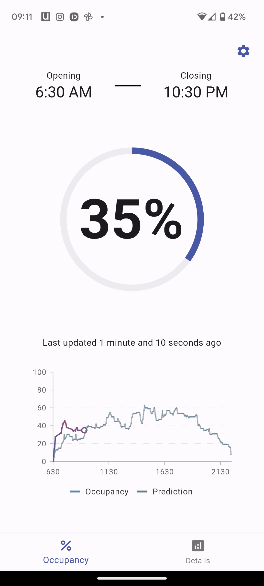
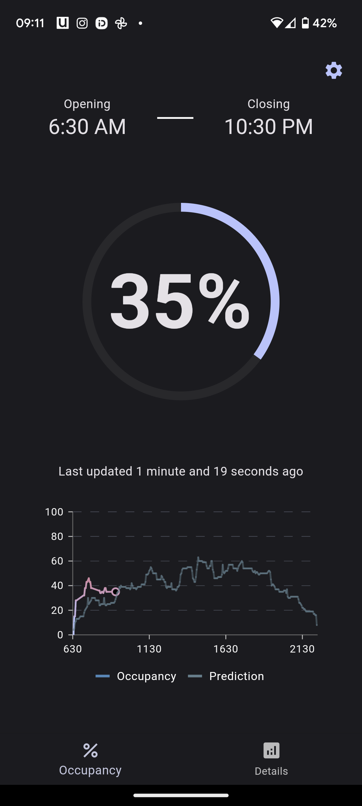
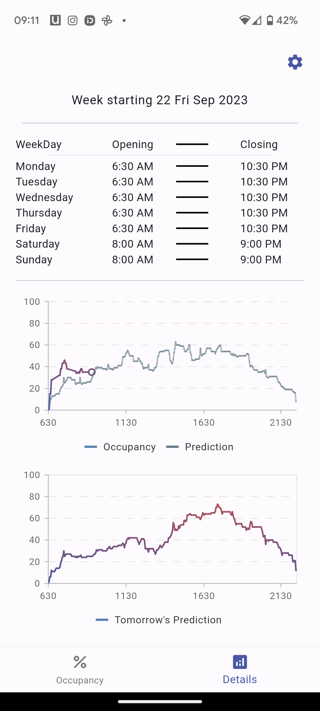
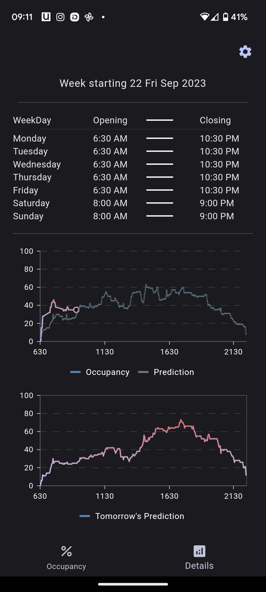
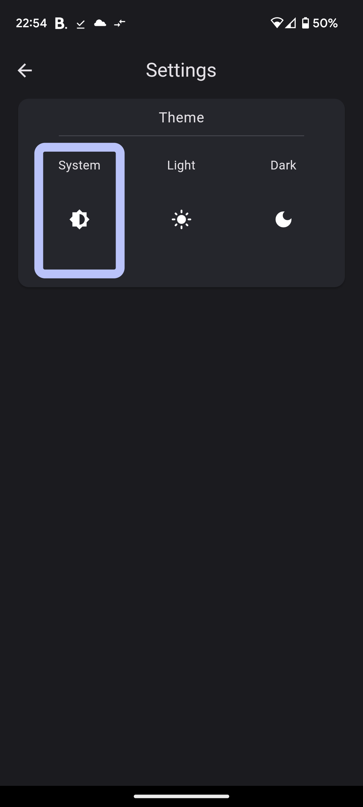

# gym_occupancy

This is the front end for the **Gym Occupancy** project.

This app follows the `CLEAN` architecture with `Riverpod` to allow easy vertical and horizontal scaling. 

Below are some photos of the application:

